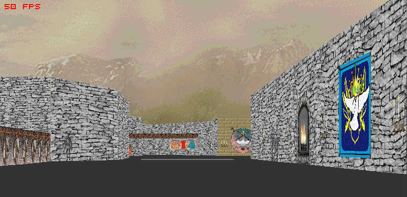

# _Hover!_ Maze Demo
A [Hover!](https://en.wikipedia.org/wiki/Hover!) maze demo made with [Umka](https://github.com/vtereshkov/umka-lang) and [Tophat](https://tophat2d.dev/). You'll need the Tophat executable and the original game assets to run it.

