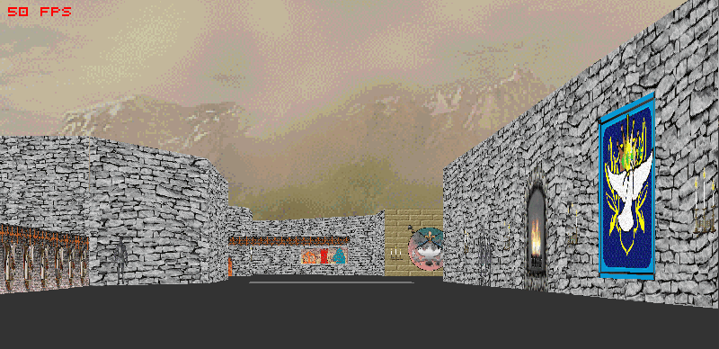
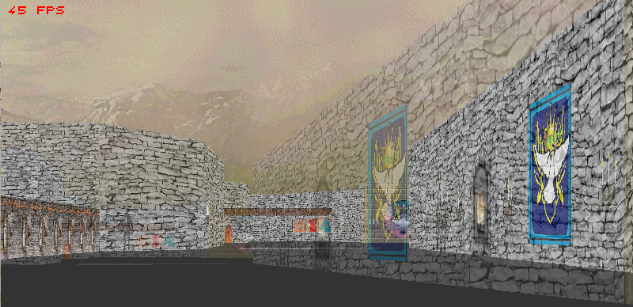

# _Hover!_ Maze Demo
A [Hover!](https://en.wikipedia.org/wiki/Hover!) maze demo made with [Umka](https://github.com/vtereshkov/umka-lang) and [Tophat](https://tophat2d.dev/).

[Download](https://github.com/vtereshkov/hover-maze/releases/)

Controls
* **Arrows**: Vehicle control
* **S**: Strabismic mode
* **Spacebar**: Eye muscle effort in strabismic mode 

Normal mode

Strabismic mode
